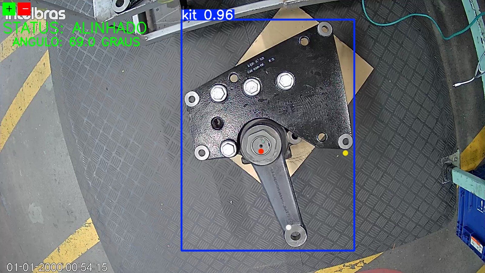

# 📐 Alignment Verification - Mercedes-Benz Parts

> **Automated Quality Control System using Computer Vision**

This project utilizes a **Keypoint Detection model (YOLOv8-pose)** to verify the precise angular alignment between the mechanical arm and the main support body of Mercedes-Benz automotive parts.

The system identifies critical geometric points on the component and calculates, in real-time, whether the assembly meets the strict tolerances required by engineering standards.

---

## 🎯 Results

The system automatically classifies the parts based on the calculated angle. Below is a side-by-side comparison of the results:

  
  
  

  <b>✅ APPROVED (Aligned)</b> &nbsp;&nbsp;&nbsp;&nbsp;&nbsp;&nbsp;&nbsp;&nbsp;&nbsp;&nbsp;&nbsp;&nbsp;&nbsp;&nbsp;&nbsp; <b>❌ REJECTED (Misaligned)</b>

---

## ⚙️ How It Works

The project pipeline was developed to ensure robustness against variations in lighting and positioning:

### 1. Annotation and Dataset
**3 strategic points** defining the part's geometry were annotated to avoid visual ambiguities:
1.  **Central Pivot (Vertex):** The rotation point of the arm.
2.  **Support Reference:** A fixed corner on the part's structure.
3.  **Arm Tip:** The moving extremity.

### 2. Training on Google Colab 🚀
The entire training process was conducted in the cloud using **Google Colab**.
- **Hardware:** Utilized T4 GPUs (free tier) for training acceleration.
- **Model:** The `YOLOv8l-pose` (Large) model was selected for maximum learning capacity of complex features.
- **Strategy:** The model was trained with *Data Augmentation* and *Patience* to prevent overfitting and ensure generalization.

### 3. Validation Logic
After model inference, a Python script processes the coordinates:
- Calculates the vectors formed by the 3 points.
- Applies trigonometry (`atan2`) to find the internal angle.
- Compares the result with the **Ideal Angle** (e.g., 65°) considering a tolerance of ±7°.

---

## 🛠️ Technologies Used

* 
* 
* 
* 

---
